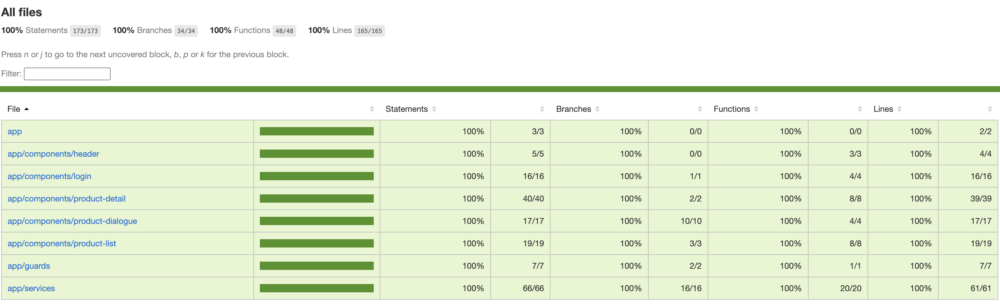

# Project hosted online, alternatively, continue below to setup project locally
- FE Angular hosted using github pages, visit https://github.com/hahazim1992/web-tm-assessment-2

# TMRND Web Assessment - Get Started

- git clone https://github.com/hahazim1992/web-tm-assessment-2
- checkout main

# Install FE packages

- install angular v18.2.20
- install node v18.20.4

# Install FE dependencies

at the root of the project
- npm install

# Start the FE App

at the root of the project
- npm run start

# Run unit test FE Jasmine Karma

at the root of the project
- npm run test
- at folder explorer, goto root > coverage > currency-dashboard > right click (index.html) > copy path > pate in google chrome > inspect unit test coverage

# Assessment Checklist + developer comments

- ✅ - DONE
- ❌ - NOT DONE / CAN'T BE DONE
- 🗯️ - DEVELOPER NOTES
#
- ✅ Login Page
- 🗯️ Able to call the API as per documentation
- 🗯️ Must be autheticated to move to product list
- 🗯️ I have prepopulate the username and password since to improve demo experience 
#
- ✅ Home Page (I) / Product List
- ✅ This module is for displaying a list of items in the form of table.
- ✅ Ensure that this module is only accessible when the user is authenticated
- ✅ Any attempt to access this module without authentication should be redirected to the Login page
- 🗯️: this is true for all available routes and components
#
- ✅ Home Page (II) / Add Product
- ✅ The product and address fields are required. The submit button should be disabled if the form is incomplete.
- ✅ Upon form completion & submission, the new product should be added to the product list in the table without page refresh.
- 🗯️: not using any API calls, only call the first time from login page
#
- ✅ Home Page (III) / Edit Product
- ✅ The edit button (pencil icon) will trigger the same modal/dialog form
- ✅ with an update and remove buttons. The input form shall contain the latest information of the product detail on show.
- ✅ Any updates to the form or removal of product shall reflect on the product list table after clicking the update or remove button without page refresh.
- 🗯️: Able to fullfill as per requirement. Not using any API to add and edit
#
- ✅ Detail Page / Product Detail
- ✅ By clicking on the product name in the product list table at home page, user will be rerouted to another page with its product id as path parameter.
- ✅ Given the following API, develop another table where:
- ✅ The start and end date by default is yesterday’s and today’s date, respectively.
- ✅ The size per page of the table is 5.
- 🗯️: Also completed pagination

# Extra Points

- ✅ Unit Test with 100% statement, branches, functions and lines coverage
- ✅ host the project at a remote server

